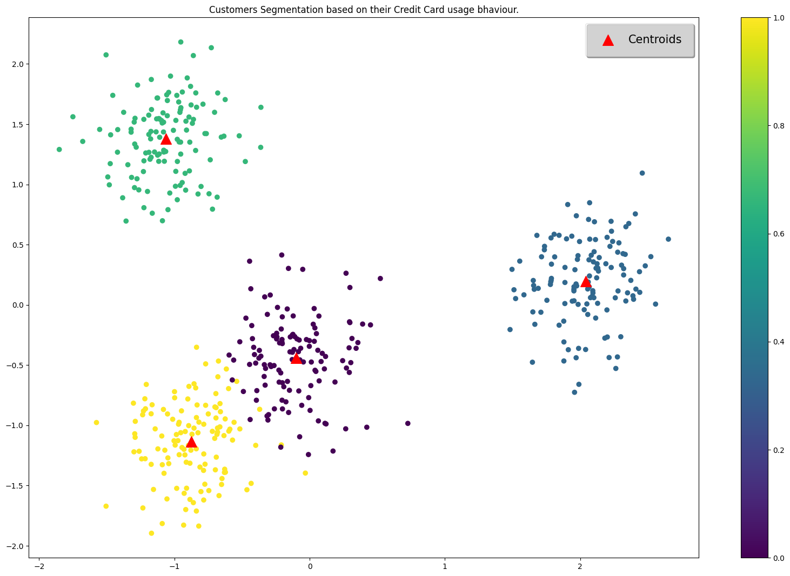
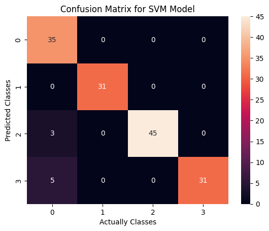

# Customer Behavior Intelligence System
<div align="center">

[](https://python.org)
[](https://python.org)
[](https://numpy.org)
[](https://scikit-learn.org)
[](https://matplotlib.org)
[](https://seaborn.pydata.org)


</div>

## 📌 Project Overview

The **Customer Behavior Intelligence System** is a machine learning solution designed to analyze customer data, identify distinct behavioral segments, and predict future customer categories. By leveraging **Unsupervised Learning (Clustering)** for segmentation and **Supervised Learning (SVM)** for classification, this system provides actionable insights to optimize marketing strategies and improve customer retention.

## 🚀 Key Features

* **Exploratory Data Analysis (EDA):** Comprehensive analysis of feature distributions and correlations to understand data structure.
* **Customer Segmentation:** Implementation of clustering algorithms (e.g., K-Means) to group customers based on purchasing behavior and usage patterns.
* **Dimensionality Reduction:** Utilization of **Principal Component Analysis (PCA)** to reduce feature space and visualize complex clusters in 2D.
* **Predictive Classification:** A Support Vector Machine (SVM) model trained to classify new customers into identified segments with high accuracy.
* **Model Evaluation:** Performance assessment using metrics like **Silhouette Score (0.77)** for clustering and Accuracy/Confusion Matrix for classification.

## 🛠️ Technologies Used

* **Language:** Python 3.13.1
* **Data Manipulation:** Pandas, NumPy
* **Machine Learning:** Scikit-Learn (K-Means, PCA, SVM)
* **Visualization:** Matplotlib, Seaborn

## 📂 Project Structure

```bash
├── Dataset.csv          # Source data for customer features
├── Model.ipynb          # Jupyter Notebook containing EDA, Clustering, and SVM training
├── README.md            # Project documentation
└── requirements.txt     # List of dependencies

```

## 📊 Methodology

1. **Data Preprocessing:** Cleaning data, handling missing values, and scaling features using `StandardScaler`.
2. **Clustering:** Applying unsupervised algorithms to discover hidden patterns in the data.
* *Result:* Achieved a high Silhouette Score of **0.773**, indicating well-separated clusters.


3. **Visualization:** Using PCA to project high-dimensional data into visualizable clusters.
4. **Classification:** Training an SVM model to predict customer segments for new data points.

## ⚙️ Installation & Usage

1. **Clone the repository:**
```bash
git clone https://github.com/youssef3082004/customer_behavior_intelligence_system.git

```


2. **Install dependencies:**
```bash
pip install pandas numpy matplotlib seaborn scikit-learn

```


3. **Run the Notebook:**
Launch Jupyter Notebook and open `Model.ipynb` to execute the analysis pipeline.

## 📈 Results

* **Clustering Performance:** The model successfully identified distinct customer groups with a Silhouette Score of **0.77**, validating the quality of the segmentation.
* **Classification Accuracy:** The SVM model achieved a robust accuracy of **94.67%** on the test set (after regularization tuning).

## 📈 Clustring Graph



## ✅ Confusion Matrix



